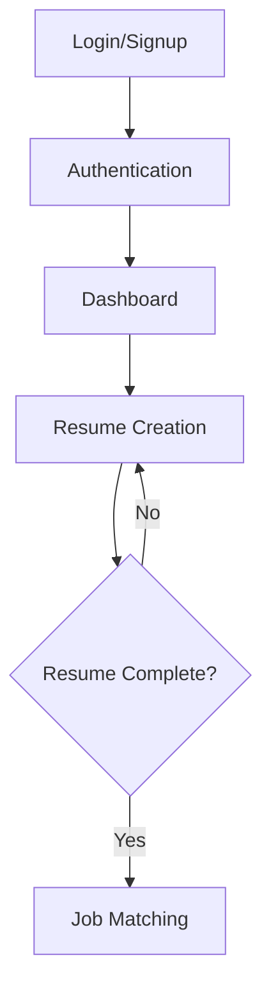

# MatchPro Application Workflow

## Application Structure

### Active Applications
1. **app-matchpro-resume**: Resume creation application (Primary Step)
2. **app-job-matching**: Job matching application (Secondary Step)

### Inactive Applications
- **app-interview-coach**: Currently on hold

## User Journey

## Detailed Flow

### 1. Authentication (Single Entry Point)
- Single login/signup page for all applications
- Authentication states:
  - Trial User (24-hour access)
  - Paid User (30-day subscription)
- Shared authentication across all apps

### 2. Dashboard
- Central hub for user navigation
- Shows user's progress and next steps
- Displays subscription status and time remaining
- Features:
  - Resume creation progress
  - Job matching status (locked/unlocked)
  - Subscription details

### 3. Resume Creation (app-matchpro-resume)
- **Status**: Required first step
- Features:
  - Resume builder
  - Template selection
  - Skills assessment
  - Experience formatting
- Must be completed before accessing job matching

### 4. Job Matching (app-job-matching)
- **Status**: Locked until resume completion
- Features:
  - Job search
  - Match scoring
  - Application tracking
- Prerequisites:
  - Completed resume
  - Active subscription

## Implementation Checklist

### Phase 1: Authentication Consolidation
- [ ] Merge auth systems into single entry point
- [ ] Implement shared session management
- [ ] Create unified login/signup pages

### Phase 2: Central Dashboard
- [ ] Create dashboard layout
- [ ] Implement progress tracking
- [ ] Add subscription status display
- [ ] Create navigation system

### Phase 3: Resume Creation Flow
- [ ] Implement resume builder
- [ ] Add progress tracking
- [ ] Create completion validation
- [ ] Store resume data

### Phase 4: Job Matching Integration
- [ ] Add resume completion check
- [ ] Implement conditional access
- [ ] Create job matching features
- [ ] Link with resume data

## Technical Notes

### Shared Components
- Authentication system
- User session management
- Progress tracking
- Navigation controls

### Data Flow
1. User data stored in shared database
2. Resume data accessible to both applications
3. Progress tracking synced across apps

### Access Control
- Resume creation: Available after authentication
- Job matching: Available after resume completion
- Both require active subscription (trial or paid)

## Future Considerations

### Potential Enhancements
- Progress saving
- Resume templates
- AI-powered suggestions
- Job application tracking

### Interview Coach Integration (Future)
- Will be integrated after core workflow is stable
- Will require completed resume
- May need additional subscription tier
